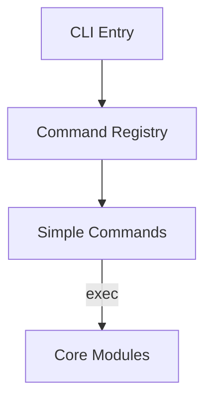
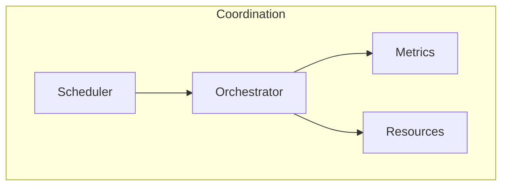
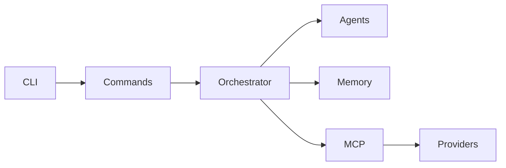

# C‑Flow Code Review Report

## Overview

C‑Flow is a large TypeScript/JavaScript project providing an AI‐driven orchestration platform. The project exposes a CLI (`claude-flow`) that manages swarms of agents, memory persistence, hooks and more. Source code lives under `src/` with many submodules.

Below is a high level summary of the most important modules.

## Module Summary

### `src/cli`
Contains the command line interface. `simple-cli.ts` is the entry point. It parses arguments, uses `command-registry.js` to dispatch commands and provides legacy fallbacks. `command-registry.js` registers many subcommands such as `init`, `start`, `swarm`, `hive-mind`, etc.

### `src/agents`
Implements agent management. `agent-manager.ts` defines structures for agent pools, clusters and scaling policies. Agents communicate through the core event bus.

### `src/memory`
Handles persistent memory via SQLite or in-memory backends. The module exports a manager and wrappers around different stores.

### `src/coordination`
Provides schedulers, load balancers and orchestrators for swarm execution. `hive-orchestrator.ts` and `swarm-coordinator.ts` are key components.

### `src/mcp`
Implements the MCP server used for task execution and tool wrapping. Contains a small HTTP server (`server.ts`), tools and wrappers for ruv-swarm integration.

### `src/providers`
Abstraction layer for various LLM providers (Anthropic, OpenAI, Google, etc.). `provider-manager.ts` selects the appropriate provider.

### `src/hive-mind`
High level hive‑mind implementation with queen/worker models and database schema (`db/hive-mind-schema.sql`).

### Other folders
- `terminal` – terminal session manager and pool.
- `ui` – console and web dashboards.
- `templates` – prompt templates for Claude.

## Data Flow and Interactions
1. **CLI** parses user commands and dispatches them to simple command handlers.
2. **Simple commands** call core modules (agents, memory, coordination) to perform actions.
3. **Core modules** interact through the event bus and orchestrator which can start agents, store memory entries and manage tasks.
4. **Providers** communicate with external LLM APIs.

## Observed Code Smells
- Several large files (e.g. `simple-cli.ts`) mix many responsibilities and include massive in‑line help text.
- Many functions are stubbed or print mock output instead of real implementation.
- Some modules are duplicated in both TypeScript and JavaScript form, making maintenance harder.
- Lack of unit tests across most modules.
- Inconsistent formatting and comment style.

## Recommendations
- Split `simple-cli.ts` into smaller files for readability.
- Remove unused stubs or move them to dedicated examples.
- Increase unit test coverage for core logic.
- Document command behaviour consistently in the code and README.
